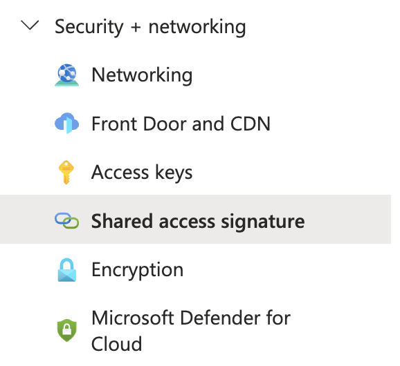

# Azure Storage Blob bash uploader

1. Create Azure Storage
2. Create Container (Blob)
3. Generate shared access signature (see image below)
4. Create script (see code block below)



Shell script to upload file to Azure Storage (Blob) using SAS (shared access signature): 

```bash
#!/bin/bash

FILE=$1
STORAGE=mystorage
CONTAINER=mycontainer
SAS=

curl -H "x-ms-blob-type: BlockBlob" --upload-file $FILE --url "https://$STORAGE.blob.core.windows.net/$CONTAINER/$FILE?$SAS"

```

## How to use


```bash

touch file.txt
bash uploader.sh file.txt

```

## Adding azcopy into mix

```bash

#!/bin/bash

FILE=$1
STORAGE=mystorage
CONTAINER=mycontainer
SAS=

# azcopy install

wget https://aka.ms/downloadazcopy-v10-linux
tar -xvf downloadazcopy-v10-linux
sudo cp ./azcopy_linux_amd64_*/azcopy /usr/bin/

azcopy cp $FILE "https://$STORAGE.blob.core.windows.net/$CONTAINER/?$SAS" --recursive=true

```