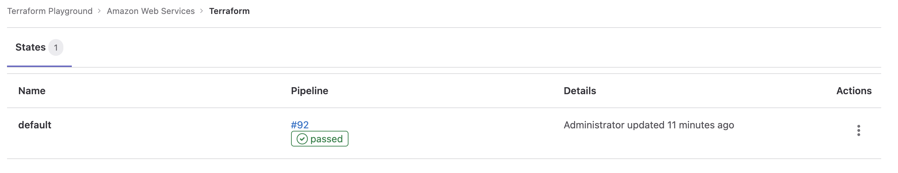

# Infrastructure as Code with Terraform and GitLab

This is a short example of what has to be added to repo in order to have workable terraform in GitLab ci with state kept in GitLab. Full doc is [here](https://docs.gitlab.com/ee/user/infrastructure/iac/).

Files are located in the [sandbox](sandbox/infrastructure-as-code-with-terraform-and-gitLab/) folder.

## CI variables

For AWS credentials are stored in CI variables: `AWS_ACCESS_KEY_ID`, `AWS_SECRET_ACCESS_KEY` and `AWS_DEFAULT_REGION` (optionally).

## State

This allows to maintain state in GitLab:

```terraform

terraform {
  backend "http" {
  }
}


```



## Templates

The [following templates](https://docs.gitlab.com/ee/user/infrastructure/iac/#use-a-terraform-template) do the magic (IaC security scan and gitlab's TF image to exec tf commands)


```yaml

include:
  - template: Terraform/Base.gitlab-ci.yml  # https://gitlab.com/gitlab-org/gitlab/blob/master/lib/gitlab/ci/templates/Terraform/Base.gitlab-ci.yml
  - template: Jobs/SAST-IaC.gitlab-ci.yml   # https://gitlab.com/gitlab-org/gitlab/blob/master/lib/gitlab/ci/templates/Jobs/SAST-IaC.gitlab-ci.yml


```


That's it!