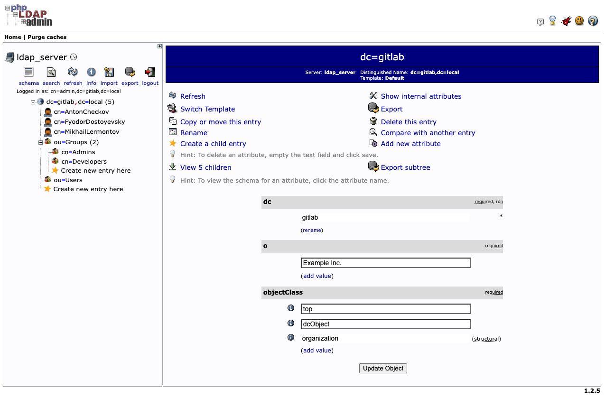

# Quick LDAP sandbox

This page contains instructions on how to execute LDAP based on OpenLDAP in container with phpLDAPAdmin (both in docker container)

```bash

#!/bin/bash

docker run \
      --name openldap-server \
        -p 389:389 \
        -p 636:636 \
        --hostname gitlab.local \
	--env LDAP_ORGANISATION="GitLab Local" \
	--env LDAP_DOMAIN="gitlab.local" \
	--env LDAP_ADMIN_PASSWORD="Pa$$word" \
    --volume /data/slapd/database:/var/lib/ldap \
    --volume /data/slapd/config:/etc/ldap/slapd.d \
    --env LDAP_BASE_DN="dc=gitlab,dc=local" \
	--detach osixia/openldap:latest

docker run \
    --name phpldapadmin \
    -p 10080:80 \
    -p 10443:443 \
    --hostname phpldapadmin-service \
    --link openldap-server:ldap-host \
    --env PHPLDAPADMIN_LDAP_HOSTS=gitlab.local \
    --detach osixia/phpldapadmin:latest

```

> Access OpenLDAP via web UI: *https://<docker_machine>:10443*

Username: cn=admin,dc=gitlab,dc=local

Password: Pa$$word



Files are located in the [sandbox](sandbox/quick-ldap-sandbox/) folder.

That's it!