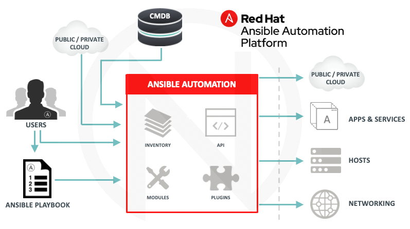

# Red Hat Ansible Automation platform cheat sheet

The Red Hat Ansible Automation platform includes several elements, which include:

* Ansible Engine – an engine used to perform playbooks and ad hoc commands.
* Ansible Tower – central service, control and management of automation within the organization.
* Automation Hub – a portal containing certified collections, roles and modules.
* Automation Analytics – analytics, reports and statistics within clusters consisting of many Ansible Towers.


# Working with Ansible 



Ansible is an open-source Continuous Deployment, Configuration Management, & Orchestration. This tool aims to provide large productivity gains to a wide variety of automation challenges and is powerful enough to automate complex multi-tier IT application environments.

## SSH Key Generation

```bash

# Setting Up SSH Command
$ sudo apt-get install openssh-server

# Generating SSH Key 
$ ssh-keygen

# Copy the SSH Key on the Hosts
$ ssh-copy-id hostname

# Check the SSH Connection 
$ ssh <nodeName>

```

## Install Ansible

On Debian / Ubuntu:

```bash

# Add Ansible repository 
$ sudo apt-add-repository ppa:ansible/ansible

# Run the update command 
$ sudo apt-get update

# Install Ansible package 
$ sudo apt-get install ansible

# Check Ansible Version
$ ansible –version

```

[Using python (OS agnostic)](https://docs.ansible.com/ansible/latest/installation_guide/intro_installation.html)

=> ~/.zshrc:

```bash

export PATH=$HOME/bin:/usr/local/bin:$HOME/.local/bin:$HOME/.local/bin:$PATH

```

## Inventory file


```json

[defaults]
inventory = inventory
remote_user = evgeny
host_key_checking = false

[privilege_escalation] 
become = True
become_method = sudo
become_user = root
become_ask_pass = False

```

## Sudo user

On target machines:

```bash

cat "evgeny ALL=(ALL) NOPASSWD: ALL" >> /etc/sudoers

```

# Bare minimum to get started

* Drop `ansible.cfg` in current folder with the content mentioned earlier.
* Drop inventory file with ip or fqdn to the host(s), also possible to use grouping
* Make sure Ansible is available (i.e. call `ansible --version`), check [Install Ansible](#install-ansible) if not

```bash

# Ad-hoc command:

ansible all -m ping

```

# Working with Ansible playbooks

Drop the following content to `playbook.yml`:

```yaml

---
- name: show fact gathering
  hosts: all
  tasks:
  - name: show all facts
    debug:
      var: ansible_facts


```

and run: 

```bash 

ansible-playbook playbook.yml

```

That's it!