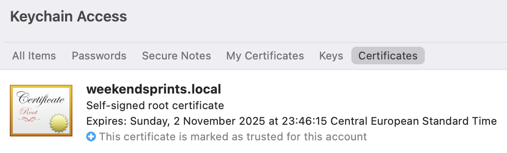

# Self Signed Certificate

In cryptography and computer security, [self-signed certificates](https://en.wikipedia.org/wiki/Self-signed_certificate) are public key certificates that are not issued by a certificate authority (CA). These self-signed certificates are easy to make and do not cost money. However, they do not provide any trust value.

## Root CA

In cryptography, a certificate authority or [certification authority](https://en.wikipedia.org/wiki/Certificate_authority) (CA) is an entity that stores, signs, and issues digital certificates. A digital certificate certifies the ownership of a public key by the named subject of the certificate. This allows others (relying parties) to rely upon signatures or on assertions made about the private key that corresponds to the certified public key. A CA acts as a trusted third party—trusted both by the subject (owner) of the certificate and by the party relying upon the certificate.[1] The format of these certificates is specified by the X.509 or EMV standard.

### Generate root CA

1. Generating RSA private key

```

openssl genrsa -aes256 -out rootCA.key 4096

```

2. Generate a root CA certificate

```

openssl req -x509 -new -nodes -key rootCA.key -sha256 -days 1024 -out rootCA.pem

```

3. View certificate's content

```

openssl x509 -in rootCA.pem -text

```

This should give two files: 

```
├── rootCA.key
└── rootCA.pem 

```

## Self Signed Certificate

Since Chrome 58 we have to define SAN (Subject Alternative Name) instead of CN ([see](https://developer.chrome.com/blog/chrome-58-deprecations/#remove-support-for-commonname-matching-in-certificates)) This change requires passing extra configuration to openssl while generating certs.

1. Generating RSA private key

```

openssl genrsa -aes256 -out cert.key 4096

```

2. Add the `san.cnf` file for Subject Alternative Name

```

authorityKeyIdentifier=keyid,issuer
basicConstraints=CA:FALSE
keyUsage = digitalSignature, nonRepudiation, keyEncipherment, dataEncipherment
subjectAltName = @alt_names

[alt_names]
DNS.1 = weekendsprints.local
DNS.2 = gitlab.local
DNS.3 = gitlab-runner.local
DNS.4 = localhost

```

3. Create a Certificate Signing Request (CSR)

```

openssl req -new -sha256 -nodes -key cert.key -out cert.csr

```

4. Generate a certificate


```

openssl x509 -req -sha256 -days 36500 -in cert.csr -CA rootCA.pem -CAkey rootCA.key -out cert.pem -extfile san.cnf -CAcreateserial

```

5. View certificate's content


```

openssl x509 -text -in cert.pem -noout

```

This should give another four files (including `san.cnf`):

```

├── cert.csr
├── cert.key
├── cert.pem
├── rootCA.key
├── rootCA.pem
└── san.cnf

```


## Certificate formats

X.509 Certificates exist in Base64 Formats **PEM (.pem, .crt, .ca-bundle)**, **PKCS#7 (.p7b, p7s)** and Binary Formats **DER (.der, .cer)**, **PKCS#12 (.pfx, p12)**.

### Convert certificates

COMMAND | CONVERSION
---|---
`openssl x509 -outform der -in cert.pem -out cert.der` | PEM to DER
`openssl x509 -inform der -in cert.der -out cert.pem` | DER to PEM
`openssl pkcs12 -in cert.pfx -out cert.pem -nodes` | PFX to PEM

## Trust to root CA

1. mac OS 

Root CA certificate has to be added to Keychain Access and set to trust.



2. RHEL 8

On Red Hat Enterprise 8.6 you should add rootCA.pem file to `/etc/pki/ca-trust/source/anchors/` and refresh trusted root certificates by running: `update-ca-trust extract`

3. Debian / Ubuntu

On Debian / Ubuntu root CA goes to `/usr/local/share/ca-certificates/` and has to be refreshed with command: `update-ca-certificates`. Keep an eye on the file's extension, it should be `.crt`!

4. Docker

If you need to container with certificate (for example nginx), you need `/usr/local/share/ca-certificates/`. Keep an eye on the file's extension, it should be `.crt`!

5. Windows

Powershell:

```

Import-Certificate -FilePath "rootCA.pem" -CertStoreLocation Cert:\LocalMachine\Root

```

> Set `-CertStoreLocation` to `Cert:\CurrentUser\Root` in case you want to trust certificates only for the logged in user.

CMD:

```

certutil.exe -addstore root rootCA.pem

```

> `certutil.exe` is a built-in tool (classic `System32` one) and adds a system-wide trust anchor.


## Example 

You can find nginx running in docker example in [sandbox](sandbox/self-signed-certificate/).

``` 

docker build . -t web
docker run -p 443:443 web
docker exec -it <container_id> curl -v https://localhost

```

```

FROM nginx:latest

COPY nginx.conf /etc/nginx/nginx.conf
COPY index.html /srv/www/weekendsprints.local/index.html
COPY cert.pem /etc/ssl/certs/cert.pem <==== certificate
COPY cert.key /etc/ssl/private/cert.key <==== key
COPY ssl_passwords.txt /etc/ssl/private/ssl_passwords.txt <==== certificate password
COPY rootCA.pem /usr/local/share/ca-certificates/rootCA.crt <==== root CA trusted by OS

```

That's it!